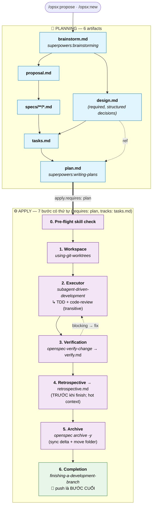

# superpowers-bridge Schema

[English](./README.md) · [繁體中文](./README.zh-TW.md) · [Tiếng Việt](./README.vi-VN.md)

[](https://github.com/AdrianTheopold/openspec-schemas/actions/workflows/validate-schemas.yml)
[](#compatibility)
[](#compatibility)

> Kết nối **artifact governance** của [OpenSpec](https://github.com/Fission-AI/OpenSpec) (**what**) với **execution skills** của [obra/superpowers](https://github.com/obra/superpowers) (**how**) vào một workflow duy nhất. Thêm artifact `retrospective` theo hướng ưu tiên bằng chứng để lấp khoảng trống mà Superpowers không hỗ trợ.
>
> Toàn bộ việc tích hợp nằm ở **prompt layer** — không sửa mã nguồn Superpowers, không thay đổi OpenSpec CLI. Schema version: v1.
>
> **Fork** từ [JiangWay/openspec-schemas](https://github.com/JiangWay/openspec-schemas) (upstream commit `f5d4040`), được duy trì độc lập từ 2026-07-02. Fork này đang được bảo trì một cách tích cực (upstream không còn hoạt động); nó phân nhánh khi cần và không nhắm tới việc đóng góp lên upstream.

---

## Cài đặt

### Cách 1: Prompt một lần cho Claude Code (khuyên dùng)

Sao chép và dán đoạn sau vào Claude Code tại thư mục gốc của project:

```
Install the superpowers-bridge schema for OpenSpec into this project:

1. Verify the project has an `openspec/` directory (run `openspec init` if missing).
2. Clone https://github.com/AdrianTheopold/openspec-schemas to a temp dir.
3. Copy the `superpowers-bridge/` subdirectory to `openspec/schemas/superpowers-bridge/`.
4. Run `openspec schema validate superpowers-bridge` to verify.
5. Run `openspec schemas` and confirm `superpowers-bridge` is listed.
6. If a CLAUDE.md exists at the project root, ask me whether to insert the workflow-routing fragment from `openspec/schemas/superpowers-bridge/templates/adopters/CLAUDE.md.fragment.<locale>.md` (auto-detect locale from existing CLAUDE.md content; default zh-TW for Traditional Chinese, no suffix for English). If I say yes, append the fragment as a new section. If no CLAUDE.md exists, skip.
7. Clean up the temp directory.
8. Verify Superpowers plugin is installed by running `claude plugin list`.
   If not listed, run `claude plugin install superpowers@claude-plugins-official`.
9. Show me the final state.
```

Giải thích các bước:

1. Kiểm tra project đã có thư mục `openspec/` chưa (chạy `openspec init` nếu chưa).
2. Tạo bản sao của `https://github.com/AdrianTheopold/openspec-schemas` vào thư mục temp.
3. Sao chép thư mục `superpowers-bridge/` vào `openspec/schemas/superpowers-bridge/`.
4. Chạy `openspec schema validate superpowers-bridge` để kiểm tra.
5. Chạy `openspec schemas` và xác nhận `superpowers-bridge` đã được liệt kê.
6. Nếu có `CLAUDE.md` ở project root, hỏi tôi có muốn chèn **workflow-routing fragment** từ `templates/adopters/CLAUDE.md.fragment.<locale>.md` không (tự động phát hiện locale từ nội dung CLAUDE.md; mặc định zh-TW cho Traditional Chinese, không suffix cho English và Vietnamese). Nếu tôi đồng ý, thêm fragment như một section mới. Nếu không có CLAUDE.md thì bỏ qua.
7. Dọn dẹp thư mục temp.
8. Kiểm tra Superpowers plugin đã được cài chưa bằng `claude plugin list`. Nếu chưa, chạy `claude plugin install superpowers@claude-plugins-official`.
9. Cho tôi xem kết quả cuối cùng.

### Cách 2: Bash thủ công (CI / môi trường không có Claude)

```bash
git clone https://github.com/AdrianTheopold/openspec-schemas /tmp/oss
cp -R /tmp/oss/superpowers-bridge ~/your-project/openspec/schemas/superpowers-bridge

# Tùy chọn: chèn workflow-routing fragment vào CLAUDE.md
# cat /tmp/oss/superpowers-bridge/templates/adopters/CLAUDE.md.fragment.md       # English
# cat /tmp/oss/superpowers-bridge/templates/adopters/CLAUDE.md.fragment.zh-TW.md # zh-TW

rm -rf /tmp/oss
cd ~/your-project
openspec schema validate superpowers-bridge
claude plugin install superpowers@claude-plugins-official  # nếu chưa có
```

---

## Nâng cấp bản cài đặt hiện tại

Nếu project đã có `openspec/schemas/superpowers-bridge/` và bạn muốn cập nhật bản mới nhất, dùng một trong các cách nâng cấp dưới đây. Việc nâng cấp sẽ ghi đè toàn bộ thư mục `superpowers-bridge/` và có tùy chọn cập nhật CLAUDE.md fragment — xem phần "Những gì bản nâng cấp sẽ ghi đè" bên dưới.

### Phương pháp nâng cấp 1: Prompt một lần cho Claude Code (khuyên dùng)

Tại thư mục gốc của project, dán đoạn dưới đây vào Claude Code:

```
Upgrade the superpowers-bridge schema in this project:

1. Verify `openspec/schemas/superpowers-bridge/` already exists (upgrade, not fresh install). If missing, abort and tell me to use the install instructions instead.
2. Clone https://github.com/AdrianTheopold/openspec-schemas to a temp dir.
3. Show me the diff between the local `openspec/schemas/superpowers-bridge/` and the cloned `superpowers-bridge/` (use `diff -ruN`). Wait for my ack before overwriting.
4. After my ack, overwrite the local schema dir with the cloned one.
5. Run `openspec schema validate superpowers-bridge` to verify.
6. Check whether this project has `CLAUDE.md` at the repo root.
   - If yes: scan it for an existing workflow-routing section referencing superpowers-bridge.
     - If found: show me the diff between that section and `superpowers-bridge/templates/adopters/CLAUDE.md.fragment.<locale>.md`. Wait for my ack before replacing.
     - If not found: ask whether to insert the new fragment from `templates/adopters/CLAUDE.md.fragment.<locale>.md`.
   - If no CLAUDE.md exists: skip.
7. Clean up the temp directory.
8. Show me the final state.
```

> `<locale>` mặc định là `zh-TW` nếu CLAUDE.md của bạn dùng Traditional Chinese, hoặc không suffix (English). Claude tự động phát hiện từ nội dung CLAUDE.md hiện tại.

### Phương pháp nâng cấp 2: Bash thủ công

```bash
# 1. Lấy bundle mới nhất
git clone https://github.com/AdrianTheopold/openspec-schemas /tmp/oss-upgrade

# 2. Xem lại sự thay đổi trước (không ghi đè một cách mù quáng)
diff -ruN ~/your-project/openspec/schemas/superpowers-bridge /tmp/oss-upgrade/superpowers-bridge

# 3. Sau khi xem xét xong, ghi đè
rm -rf ~/your-project/openspec/schemas/superpowers-bridge
cp -R /tmp/oss-upgrade/superpowers-bridge ~/your-project/openspec/schemas/superpowers-bridge

# 4. Kiểm tra lại
cd ~/your-project && openspec schema validate superpowers-bridge

# 5. CLAUDE.md fragment (thủ công)
# Xem /tmp/oss-upgrade/superpowers-bridge/templates/adopters/CLAUDE.md.fragment.md
# So sánh với CLAUDE.md của bạn và chèn/cập nhật phần tương ứng nếu cần

# 6. Dọn dẹp
rm -rf /tmp/oss-upgrade
```

### Những gì bản nâng cấp sẽ ghi đè

| Path | Action | Cần thao tác thủ công? |
| --- | --- | --- |
| `openspec/schemas/superpowers-bridge/` | Tự động ghi đè — toàn bộ thư mục được thay thế từ upstream (`rm -rf` + `cp -R` trong Phương pháp 2; tương tự trong Phương pháp 1) | Không |
| `CLAUDE.md` (project root) | Thư mục schema chứa `templates/adopters/CLAUDE.md.fragment.<locale>.md`; các bước nâng cấp sẽ xem sự thay đổi của CLAUDE.md hiện tại với fragment và chờ xác nhận trước khi chèn/thay thế | Có — xem xét thay đổi, chọn chèn / thay thế / giữ lại |

> Thư mục bridge là nguyên khối — bạn lấy toàn bộ phiên bản mới hoặc giữ nguyên phiên bản cũ. Không có per-file opt-in. CLAUDE.md là file duy nhất ở thư mục gốc của project mà sự nâng cấp động tới, và không bao giờ động tới nếu không có xác nhận của bạn.
>
> Các thay đổi đang diễn ra (bất kỳ giai đoạn nào: brainstorm / design / specs / ...) vẫn có hiệu lực vì schema graph (`requires:` edges, PRECHECK, artifact dependencies) không thay đổi trong v1.x. Các `verify.md` / `retrospective.md` có sẵn từ trước nâng cấp vẫn đọc được; nếu bạn chạy lại `/opsx:verify` hoặc `/opsx:continue → retrospective` trên chúng, cấu trúc template mới sẽ được áp dụng khi ghi đè.
>
> Nếu nâng cấp trong tương lại thay đổi schema graph về mặt cấu trúc (artifact thêm/xóa, `requires:` edge thay đổi, PRECHECK thay đổi), README sẽ có thêm thuộc tính lưu phiên bản và hướng dẫn chuyển đổi. v1 → v1.x chỉ thay đổi giọng văn, an toàn và không cần chuyển đổi.

---

## Vấn đề schema này giải quyết

OpenSpec quản lý **what to do** (artifact lifecycle: proposal / specs / tasks / verify, v.v.). Superpowers quản lý **how to do it** (quy tắc thực hiện: brainstorming, writing-plans, TDD, code review). Mỗi hệ thống đều tốt khi đứng một mình; nhưng khi kết hợp trong phát triển thực tế xuất hiện 3 vấn đề cấu trúc:

1. **Đầu ra lặp lại** — brainstorming ghi đầu ra của design vào `docs/superpowers/specs/`; OpenSpec tạo lại `proposal.md` / `design.md` trong thư mục change, nội dung chồng chéo.
2. **Nhiệm vụ phân mảnh** — `tasks.md` của OpenSpec (coarse checkboxes) và `plan.md` của Superpowers (TDD micro-steps) mô tả cùng một công việc với định dạng, vị trí và công cụ theo dõi tiến độ khác nhau.
3. **Điều phối thủ công** — người dùng phải tự quyết định mỗi bước nên gọi skill nào; hai hệ thống không tự kết nối với nhau.

### Tại sao là custom schema mà không sửa skills hiện có?

Hai phương án đã được cân nhắc và bị từ chối:

- **Thêm các trường riêng vào `config.yaml`** (ví dụ `skill_bindings`): OpenSpec CLI không nhận diện được — không xác nhận, không được tìm thấy, phải sửa nhiều file SKILL.md.
- **Sửa trực tiếp opsx skill files**: xâm lấn (ảnh hưởng mọi change) và dễ hỏng (bị ghi đè khi nâng cấp SKILL.md).

Custom schema sử dụng **cơ chế project-level schema native** của OpenSpec: CLI xác nhận cấu trúc, `openspec schemas` tự động liệt kê, mỗi change chọn schema độc lập (`--schema spec-driven` hoặc `--schema superpowers-bridge`), và không sửa bất kỳ SKILL.md hay file lệnh nào.

---

## Entry & exit gates

Các instruction của schema này chỉ hoạt động khi được gọi qua các lệnh `/opsx:*`. Nếu bạn kích hoạt Superpowers skills qua narrative — ví dụ nói "let's discuss the architecture" — hành vi mặc định bypass schema. Brainstorming sẽ vẫn ghi vào `docs/superpowers/specs/`, làm mất tác dụng redirect của integration.

Phần này gồm ba nội dung:

1. Khi nào bạn không cần vào schema (chỉ cần mở PR)
2. Khi nào verbal brainstorming nên được promote thành opsx change
3. Front-door anti-patterns cần tránh sau khi schema đã được cài

### Khi nào KHÔNG cần vào schema (direct PR)

Không phải change nào cũng cần thư mục `change`. Các trường hợp sau nên bỏ qua opsx:

| Scenario | Cần change? | Làm gì |
| --- | --- | --- |
| New feature / capability mới | ✅ Có | `/opsx:new <name> --schema superpowers-bridge` |
| Breaking change | ✅ Có | Giống trên |
| Architecture change | ✅ Có | Giống trên |
| Bug fix (khôi phục hành vi mong đợi, không thay đổi contract) | ❌ Không | Direct PR |
| Test backfill / coverage | ❌ Không | Direct PR |
| Build tooling tweak (linter rule, coverage threshold) | ❌ Không | Direct PR |
| Non-breaking dependency upgrade | ❌ Không | Direct PR |
| Documentation update / typo fix | ❌ Không | Direct PR |
| Config value tweak (không thay đổi cấu trúc) | ❌ Không | Direct PR |

> Nguyên tắc: **process ceremony nên scale với risk**. External contracts, cross-system integration, DB schema changes, compliance boundaries → chạy change. Typos, bug fixes, timeout adjustments → direct PR. Với trường hợp mơ hồ, dùng 5-condition checklist bên dưới.

### Khi nào verbal brainstorming nên được promote thành change

Nếu `superpowers:brainstorming` được trigger qua narrative ("let's brainstorm the architecture") trong project dùng schema này, output của brainstorming **KHÔNG ĐƯỢC** đưa vào `docs/superpowers/specs/` — như vậy sẽ bypass output redirection của schema và tạo orphan artifacts.

Flow đúng: tiếp tục brainstorming bằng lời cho tới khi cả 5 điều kiện sau đều thỏa mãn, sau đó promote lên `/opsx:propose` hoặc `/opsx:new` để design đã thống nhất được đưa vào `openspec/changes/<name>/brainstorm.md`.

1. **Scope locked** — một câu mô tả được in/out, scope không tiếp tục phình ra sau mỗi lượt
2. **Major design forks resolved** — các phương án đã được cân nhắc và chọn một; các unknowns còn lại là **explicit TBDs** (kèm owner và impact-scope statement), không phải "haven't thought about it yet"
3. **Cross-system dependencies mapped** — với mỗi dependency: chọn ready / mockable / genuinely unknown
4. **Acceptance criteria stateable** — điều kiện pass cụ thể (ví dụ `./mvnw clean verify` passes + N deliverable cụ thể)
5. **Conversation converging** — 1-2 lượt cuối là xác nhận, không còn fork "what about..." mới

Nếu thiếu bất kỳ điều kiện nào, tiếp tục brainstorming. Khi cả 5 điều kiện đều thỏa:

- Model **nên chủ động gợi ý** "this looks ready for `/opsx:propose` — want to open a change?"
- Người dùng **cũng có thể chủ động nói** "open this as an opsx change"
- Dù cách nào, **promotion cần human ack có chủ đích** — không bao giờ tự động

### Front-door anti-patterns

| Anti-pattern | Tại sao sai |
| --- | --- |
| Để brainstorming ghi vào `docs/superpowers/specs/` sau khi schema đã được cài | Bypass block `IMPORTANT output redirection` trong instruction của artifact **brainstorm** ([schema.yaml](./schema.yaml)); tạo orphan artifacts. Verify §6 phát hiện điều này. |
| Để writing-plans ghi vào `docs/superpowers/plans/` | Lý do tương tự — block tương đương trong instruction của artifact **plan**. Verify §6 phát hiện điều này. |
| Promote lên opsx với unresolved blocking TBDs | Các TBD đó sẽ block apply phase — promotion chỉ trì hoãn vấn đề |
| Mở change cho bug fix / typo / config tweak | Process ceremony vượt quá risk thực tế; chậm delivery mà không có giá trị |

---

## Workflow & Integration

### Artifact DAG

```text
brainstorm ──┬──→ proposal ──→ specs ──┐
             │                         ├──→ tasks ──→ plan ──→ [apply] ──→ verify ──→ retrospective
             └──→ design ──────────────┘
```

Khác biệt so với `spec-driven`:

| | spec-driven | superpowers-bridge |
| --- | --- | --- |
| Entry | proposal (manual) | **brainstorm** (gọi brainstorming skill) |
| Plan layer | tasks (coarse) | tasks + **plan** (TDD micro-steps) |
| apply requires | tasks | **plan** |
| apply method | task-by-task tiêu chuẩn | **worktree + subagent-driven-development** (kèm TDD + code-review transitive) |
| Post-apply | (không có) | **verify** + **retrospective** artifacts |
| Artifact mới | — | brainstorm, plan, verify, retrospective |

### Lifecycle (apply orchestration + timing notes)

Artifact DAG ở trên thể hiện **file-existence** dependencies. Lifecycle runtime dưới đây thêm các bước có thứ tự của apply phase và **timing offsets** giữa graph edges và thứ tự sản xuất thực tế.



ASCII fallback (CLI-readable):

```text
PLANNING ━━━━━━━━━━━━━━━━━━━━━━━━━━━━━━━━━━━━━━━━━━━━━━━━━━━━━━
  brainstorm.md ──┬─→ proposal.md ──→ specs/**/*.md ──┐
                  │                                   ├─→ tasks.md ──→ plan.md
                  └─→ design.md (required) ───────────┘
                                                                       │
                           apply.requires: [plan], apply.tracks: tasks ▼
APPLY ━━━━━━━━━━━━━━━━━━━━━━━━━━━━━━━━━━━━━━━━━━━━━━━━━━━━━━━━
  0. Pre-flight skill check
  1. superpowers:using-git-worktrees
  2. superpowers:subagent-driven-development (+ TDD + code-review transitive)
  3. openspec-verify-change → verify.md ◄┐
                              │           │ blocking → fix
                              ▼           │
  4. retrospective.md (TRƯỚC khi PR; hot context)
  5. openspec archive -y (sync delta + move folder)
  6. superpowers:finishing-a-development-branch (🏁 push là BƯỚC CUỐI)
```

> **Timing notes** (lý do đầy đủ trong "Six design touches" #6):
> - `verify.md` khai báo `requires: plan` trong graph nhưng thực tế được tạo ra ở apply step 3.
> - `retrospective.md` khai báo `requires: verify` và theo Step 4 được tạo **trước** finish/push (step 6) — để branch được push bao gồm toàn bộ cycle đã archive (artifacts done, spec synced, change folder dưới `archive/`).
> - Các edge `requires:` là file-existence dependencies cho graph engine của OpenSpec; runtime ordering nằm trong instruction prose.

### Bảy Superpowers touchpoints

| # | Superpowers skill | Được gọi ở đâu | Trigger |
| --- | --- | --- | --- |
| 1 | `superpowers:brainstorming` | artifact `brainstorm` instruction | Trực tiếp (kèm PRECHECK) |
| 2 | `superpowers:writing-plans` | artifact `plan` instruction | Trực tiếp (kèm PRECHECK) |
| 3 | `superpowers:using-git-worktrees` | apply step 1 | Trực tiếp |
| 4 | `superpowers:subagent-driven-development` | apply step 2 | Trực tiếp |
| 5 | `superpowers:test-driven-development` | (được kích hoạt bên trong #4) | **Transitive** |
| 6 | `superpowers:requesting-code-review` | (được kích hoạt bên trong #4) | **Transitive** |
| 7 | `superpowers:finishing-a-development-branch` | apply step 6 | Trực tiếp |

Thêm một OpenSpec built-in: `openspec-verify-change` (apply step 3, tạo ra `verify.md`).

> **Không có fallback `executing-plans`.** Schema này có opinion: nó yêu cầu nền tảng hỗ trợ subagent (Claude Code, Codex, v.v.). Executor thay thế `superpowers:executing-plans` không kích hoạt transitive TDD hoặc code-review (đã kiểm tra với [SKILL.md](https://github.com/obra/superpowers/blob/v6.3.0/skills/executing-plans/SKILL.md) của nó) — fallback sẽ âm thầm làm giảm core value của Superpowers. Nếu nền tảng của bạn không hỗ trợ subagent, hãy dùng built-in `spec-driven` schema.

### Output redirection

Các Superpowers skills có default output paths (ví dụ: brainstorming ghi vào `docs/superpowers/specs/`). Schema này dùng artifact instructions để **override** hành vi đó bằng cách inject context chuyển hướng output vào change directory:

- brainstorming → `openspec/changes/<name>/brainstorm.md`
- writing-plans → `openspec/changes/<name>/plan.md`

Được thực hiện hoàn toàn qua context injection tại thời điểm gọi skill, không sửa source skill.

---

## Sử dụng

### Quick flow (recommended)

```bash
/opsx:ff my-feature    # one-shot: scaffold + brainstorm + proposal + design + specs + tasks + plan
/opsx:apply            # worktree + subagent-driven-development (kèm TDD + code-review)
/opsx:verify           # tạo verify.md (7 checks)
/opsx:continue         # → retrospective (tạo retrospective.md, §0 + 6 sections)
/opsx:archive          # archive
```

### Step-by-step flow

```bash
/opsx:new my-feature --schema superpowers-bridge
/opsx:continue         # → brainstorm (interactive dialogue)
/opsx:continue         # → proposal
/opsx:continue         # → design (sắp xếp brainstorm thành structured decisions)
/opsx:continue         # → specs
/opsx:continue         # → tasks
/opsx:continue         # → plan
/opsx:apply            # → implementation + worktree + subagent-driven-development
/opsx:verify           # → verify.md (post-apply, chạy 7 checks)
/opsx:continue         # → retrospective.md (post-verify, evidence-first §0 + 6 sections)
/opsx:archive
```

> **Profile note — opsx flow của bridge này yêu cầu OpenSpec's expanded workflow profile.** Core profile (mặc định của `openspec init`) chỉ cung cấp `propose, explore, apply, sync, archive`; các lệnh chỉ có trong expanded: `new, continue, ff, verify, bulk-archive, onboard` — và bridge này dùng `/opsx:continue`, `/opsx:ff`, và `/opsx:verify` xuyên suốt, không chỉ `/opsx:new`. Enable expanded set bằng `openspec config profile` (chọn full workflow set trong picker) rồi `openspec update`; chạy `openspec update` một mình **không** chuyển profile. Nếu bạn phải dùng core, chỉ có bước đầu tiên có CLI equivalent (`openspec new change <name> --schema superpowers-bridge`) — `/opsx:continue`/`/opsx:verify` không có, nên expanded profile gần như bắt buộc. (`/opsx:new` là create-command duy nhất chấp nhận `--schema`; `/opsx:propose` và `/opsx:ff` dùng default schema của project.)

### Chuyển về spec-driven

```bash
# Dùng schema khác cho một change
/opsx:new my-simple-fix --schema spec-driven

# Hoặc đổi default schema trong openspec/config.yaml: schema: spec-driven
```

---

## Apply phase walkthrough

`/opsx:apply` kích hoạt các bước trong `apply.instruction` của [schema.yaml](./schema.yaml):

#### 0. Pre-flight — kiểm tra Superpowers skills cần thiết

Xác nhận các skill sau đã được cài trước khi tiếp tục:

- `superpowers:using-git-worktrees`
- `superpowers:subagent-driven-development` (transitive: `test-driven-development`, `requesting-code-review`)
- `superpowers:finishing-a-development-branch`

Thiếu skill → DỪNG với lỗi rõ ràng. Không silent fallback, không manual mode trong schema này. Người dùng nên cài Superpowers hoặc chuyển sang built-in `spec-driven` schema cho change đó.

> Phiên bản v0 từng có bước "auto-commit change artifacts to current branch" ở đây. Nó đã bị xóa sau [PR #970 review](https://github.com/Fission-AI/OpenSpec/pull/970): xử lý untracked change directories là trách nhiệm của worktree skill, không phải của schema.

#### 1. Workspace — `superpowers:using-git-worktrees`

Tạo `.worktrees/<change-name>/`, chuyển sang branch mới, chạy setup, xác nhận test baseline sạch.

#### 2. Executor — `superpowers:subagent-driven-development`

Main agent đọc `plan.md`, dispatch subagent mới cho mỗi micro-task:

- **TDD** (`superpowers:test-driven-development`): mỗi subagent kích hoạt transitive — viết failing test → xem nó fail → code tối thiểu → pass; production code không có test trước sẽ bị xóa
- **Per-task review**: sau mỗi task, controller dispatch merged task-reviewer của subagent-driven-development (spec-compliance + code-quality) — không phải skill riêng; critical issues chặn forward motion

Cả hai committed ledgers đều được tick khi tasks hoàn thành — coarse `tasks.md` checkboxes và các `plan.md` step boxes của task đã clear — trong cùng bookkeeping step với SDD progress-ledger line. Một step bị defer thay vì clear được đánh dấu `[~]` trong `plan.md` ngay tại thời điểm đó, vì đó chính là thứ verify §7 đọc. Sau tất cả tasks, final whole-branch code review (`superpowers:requesting-code-review`) bao phủ toàn bộ implementation.

Schema này KHÔNG hỗ trợ `superpowers:executing-plans` làm fallback. Xem phần "Six design touches" bên dưới để biết lý do.

#### 3. Verification — `openspec-verify-change`

Tạo `verify.md` từ 7 checks: structural validation (`openspec validate --all --json`), task completion, delta-spec sync state, design/specs coherence (non-blocking warning), implementation signal (code đã commit), front-door routing leak detector (non-blocking warning), và deferred-dogfood vs automated-test equivalence. Check cuối chỉ block khi `plan.md` có `[~]` deferrals nhưng equivalence section để trống (gap analysis bị skip); nếu không thì chỉ informational.

Failures được route ngược lại artifact tương ứng để fix; verify có thể chạy lại.

> **Steps 4–6 là post-verify sequence chuẩn: retro → archive → PR. Reordering sẽ tạo PR không hoàn chỉnh (retrospective + archive thành post-merge commits, mất hot context).**

#### 4. Retrospective — artifact `retrospective` (recommended; theo Entry & exit gates skip rules, trivial fixes có thể bỏ qua)

Evidence-first reflection: §0 Evidence (quantitative front-matter — commit count, diff size, tasks-done ratio, dependencies, validate state, v.v.) cộng 6 analysis sections (Wins / Misses / Plan deviations / Skill compliance / Surprises / Promote candidates). Mỗi claim trích dẫn commit / file / measurable fact, thường tham chiếu §0 thay vì inline evidence mỗi bullet. Procedure được nhúng trong artifact instruction — không cần external skill (Decision 3 trong design spec defer Claude Code plugin packaging lên v1.x).

Được viết **trước khi** mở PR để retro nằm trong cùng PR diff.

#### 5. Archive — `openspec archive -y` (hoặc `/opsx:archive`)

Sync delta specs vào `openspec/specs/<capability>/spec.md` và chuyển change folder sang `openspec/changes/archive/YYYY-MM-DD-<name>/`. Chạy **trước khi** mở PR để diff phản ánh toàn bộ cycle đã archive.

#### 6. Completion — `superpowers:finishing-a-development-branch`

Xác nhận tests đều xanh, đưa ra các tùy chọn merge / PR / keep-branch / discard. Worktree chỉ được dọn khi chọn merge hoặc discard; push/PR path giữ nguyên worktree để có thể iterate trên PR feedback. **PR là bước cuối cùng** — nếu retro hoặc archive chưa làm thì phải làm trước.

---

## CLI cheat sheet

| Scenario | Command |
| --- | --- |
| New change (interactive) | `/opsx:new <name> --schema superpowers-bridge` rồi `/opsx:continue` |
| New change (one-shot) | `/opsx:ff <name>` |
| Resume change bị gián đoạn | `/opsx:continue <name>` |
| Vào implementation | `/opsx:apply <name>` |
| Manual verify | `/opsx:verify <name>` |
| Archive | `/opsx:archive <name>` |
| Dùng built-in (skip brainstorm) | `/opsx:new <name> --schema spec-driven` |
| Liệt kê tất cả schemas trong project | `openspec schemas` |
| Xem progress của một change | `openspec status --change <name> --json` |
| Liệt kê active changes | `openspec list` |
| Validate toàn bộ project | `openspec validate --all --json` |

---

## Sáu design touches đáng nhớ

### 1. Skill-name PRECHECK (Layer 1 capability detection)

Mỗi artifact / apply step gọi Superpowers skill đều chạy PRECHECK ở đầu instruction, xác nhận skill tồn tại trong danh sách available skills của LLM. **Thiếu skill = STOP, không silent fallback.** Đây là câu trả lời cụ thể cho layer 1 của [PR #970 review](https://github.com/Fission-AI/OpenSpec/pull/970) concern #1 — fail loud, fail early.

### 2. Schema-level vs prompt-level integration

Integration hoàn toàn nằm trong `instruction:` fields (pure prompts). Nếu Superpowers nâng cấp behavior của một skill, schema không cần thay đổi. Ta chỉ sửa `schema.yaml` nếu skill bị rename hoặc bị xóa.

### 3. Transitive dependencies được làm explicit

TDD và code-review bình thường bị ẩn trong SKILL.md của `subagent-driven-development`. Schema này ở apply step 2 instruction liệt kê rõ hai transitive activations này để người đọc có thể thấy "what actually happens during apply" trong nháy mắt.

### 4. Opinionated: chỉ nền tảng subagent, không manual fallback

Schema này yêu cầu nền tảng hỗ trợ subagent (Claude Code, Codex, v.v.). Executor thay thế `superpowers:executing-plans` KHÔNG kích hoạt transitive TDD hoặc code-review (đã kiểm tra với [SKILL.md](https://github.com/obra/superpowers/blob/v6.3.0/skills/executing-plans/SKILL.md) — body của nó không đề cập tới cả hai, và Integration section omit cả `test-driven-development` lẫn `requesting-code-review`). Fallback sang nó sẽ âm thầm mất đi giá trị Superpowers mang lại cho integration này. Chúng tôi thà fail loud ở Step 0 và hướng người dùng tới built-in `spec-driven` schema.

### 5. Evidence-based PRECHECK cho verify và retrospective (Layer 2 capability detection)

Mỗi timing-sensitive artifact chạy các concrete shell evidence checks ở đầu instruction:

- **verify**: `git log <base>..HEAD | wc -l > 0` AND `grep -cE '^\s*- \[x\]' tasks.md > 0` AND `grep -cE '^\s*- \[[x~]\]' plan.md > 0`
- **retrospective**: `test -f verify.md` VÀ `! grep -q '^- \[x\] ❌ FAIL' verify.md`

LLM không cần diễn giải timing prose — nó chạy lệnh và đọc kết quả. Đây là layer 2 của concern #1 / mitigation cho concern #2.

### 6. verify và retrospective là time-mismatched artifacts (known limitation)

`verify.requires: [plan]` và `retrospective.requires: [verify]` là file-existence dependencies trong schema graph, nhưng mỗi instruction ghi rõ "MUST run AFTER apply phase / verify pass". Đây là intentional misalignment — engine của OpenSpec chỉ kiểm tra predecessor file existence. Engine-native fix đang chờ khái niệm `post_apply` phase upstream (tương tự spec-kit's `after_implement` hook); evidence-based PRECHECK ở trên là mitigation cho v1.

---

## Versioning

Bundle này có **hai version identifiers** không nên nhầm lẫn:

| Identifier | Ở đâu | Ý nghĩa | Ví dụ |
| --- | --- | --- | --- |
| Schema major | `schema.yaml: version: 1` | Contract của schema graph (artifacts, `requires:` edges, PRECHECK shape). Breaking changes bump số này. | `1` |
| Bundle release | `VERSION` file + git tag | SemVer release của bundle này, scoped trong một schema major. | `1.0.0` (tag `v1.0.0`) |

Bundle release `1.x.y` là một published cut của schema major `v1`. Schema major `v2` trong tương lai sẽ restart bundle releases ở `2.0.0`. Adopters pinning tới `v1.x.y` được đảm bảo schema-graph compatibility trong v1 major.

> Compatibility matrix bên dưới dùng `v1` (schema major) làm row key, vì compatibility với OpenSpec / Superpowers được quyết định bởi schema contract, không phải patch-level edits trong bundle này.

## Compatibility

Baseline versions mà schema này được author dựa trên. Đây là **historical snapshot, không phải end-to-end compatibility guarantee** — CI không thể chạy full prompt-layer workflow trong headless mode, nên behavioral compatibility dựa vào human review khi drift xảy ra.

Bundle release hiện tại: **`1.4.0`** (xem [VERSION](./VERSION)).

| superpowers-bridge | OpenSpec CLI | Superpowers plugin | Baseline as of |
| --- | --- | --- | --- |
| v1 | `1.13.0` | `6.3.0` | 2026-09-16 |
| v1 | `1.5.0` | `6.2.0` | 2026-08-12 |
| v1 | `1.5.0` | `6.1.0` | 2026-07-02 |

> Đã re-attest với **OpenSpec 1.13.0** (2026-09-16, bundle 1.4.0), chỉ phía OpenSpec. Về cấu trúc: grammar của schema file không đổi từ 1.4.1 (năm top-level keys), `openspec schema validate` pass, instructions render bình thường, và mọi CLI command mà schema này nhắc tới vẫn tồn tại. Các thay đổi đã hấp thụ: bốn artifact instructions mà bridge từng copy từ `spec-driven` schema 1.4.1 (proposal, specs, design, tasks) đã được refresh theo text của 1.13 — kiểm kê spec hiện có bằng `openspec list --specs` + `openspec show --type spec` trước khi đặt tên capabilities (bản đôi ở spec-level của reuse check trong plan artifact), `skip_specs: true` là cách duy nhất để một change zero-delta pass `openspec validate`, delta của capability mới phải mở đầu bằng `## Purpose` (nếu không archive sẽ để lại placeholder `TBD`), hỗ trợ nested `<capability-path>`, mỗi task phải ghi rõ cách verify, và design open questions chỉ giới hạn ở unknowns có thể defer. Thêm một quy tắc upstream không có: block MODIFIED phải giữ mọi scenario mà main spec vẫn có (1.13 enforce ở validate và archive). Không bị ảnh hưởng: stores vẫn opt-in và không dùng; bridge cố ý giữ paths `openspec/specs/` tương đối theo repo.
>
> Đã re-attest với **Superpowers 6.3.0** (2026-09-16, bundle 1.4.0) qua full v6.2.0→v6.3.0 skill diff, bản đã cài xác nhận giống hệt upstream tag. Không đổi và vẫn đúng: `executing-plans` không kích hoạt cả TDD lẫn code-review (file giống hệt); `using-git-worktrees` mặc định `.worktrees/` (giống hệt); `test-driven-development` và `requesting-code-review/SKILL.md` giống hệt; SDD vẫn kết thúc bằng việc gọi finishing + xóa workspace (suppression của apply vẫn cần thiết) và vẫn review mỗi task bằng merged spec-compliance + code-quality reviewer; finishing vẫn chạy lại suite, đưa ra merge / push / keep với discard chỉ khi có typed request rõ ràng, và tạo PR/MR khi push. Ba behavioral changes đã hấp thụ: (1) **brainstorming** giờ phân loại spike / bounded / architectural và chỉ architectural path mới viết spec rồi handoff cho writing-plans — brainstorm instruction chốt classification là architectural, vì một change vào schema này đã qua entry gate; (2) **writing-plans** mở plan bằng header `**Spec:**` mà SDD coi là binding authority cho rulings — plan instruction và template điền vào đó delta specs + design.md của change để không ruling nào là provisional; (3) **subagent-driven-development** tự ruling khi gặp plan conflicts thay vì hỏi ("rulings, not stalls"), chỉ dừng ở bốn classes đã nêu tên, và xuất exhaustive list "Rulings I made" khi xóa workspace — đúng step mà bridge này suppress — nên apply step 2 giờ yêu cầu list đó trong report của executor, verify check 4 test từng ruling với specs, và retrospective §3 ghi lại. Hai thay đổi 6.3.0 khác không cần gì từ bridge: finishing hỏi trước khi worktree removal bị từ chối thay vì ép buộc, và implementer / reviewer prompts có thêm no-subagents contract.
>
> Đã re-attest với **Superpowers 6.2.0** (2026-08-12), đối chiếu claim-by-claim với installed skills. Một behavioral change đã hấp thụ: `finishing-a-development-branch` lấy lại PR/MR creation — push option giờ push VÀ mở PR/MR qua forge CLI, điều mà apply step 6 cho phép (auto-merge vẫn cấm); menu là merge / push / keep, với discard chỉ khi có explicit request. Mọi load-bearing claims còn lại vẫn đúng: SDD vẫn kết thúc bằng việc gọi finishing (suppression của apply-instruction vẫn cần thiết), vẫn transitively enforce TDD + requesting-code-review với merged task-reviewer prompt; `executing-plans` vẫn không kích hoạt cả hai (fallback vẫn unsupported); `using-git-worktrees` vẫn mặc định `.worktrees/`.
>
> Đã re-attest với **Superpowers 6.1.0** (2026-07-02) qua full v5.1.0→6.1.0 skill diff: chỉ `finishing-a-development-branch` (tùy chọn push không còn auto-create PR) và merged SDD task-reviewer cần prose alignment; SDD self-finish conflict có từ trước v6 và bị suppress bởi apply instruction. **OpenSpec 1.5.0** "Stores" là opt-in beta và không ảnh hưởng tới bridge này — chỉ cần kiểm tra lại `changes/`+`specs/` paths nếu future release biến Stores thành default layout.

### Cách kiểm tra

Contract gồm hai layer — **baseline declaration + human review** — không phải automated compatibility enforcement. (Automated weekly drift bot đã ngừng hoạt động khi fork này được tạo — upstream JiangWay không còn hoạt động.)

| Layer | Cơ chế | Bắt được gì | Khi nào chạy |
| --- | --- | --- | --- |
| Structural | [`validate-schemas.yml`](../.github/workflows/validate-schemas.yml) mỗi push/PR | Schema-graph breaks (field renames, mất `requires:` edges, PRECHECK syntax thay đổi) | CI run báo đỏ |
| Baseline drift | Manual — maintainer định kỳ so sánh pinned baselines với latest OpenSpec / Superpowers releases | Pinned ≠ latest upstream | Maintainer bump baselines + re-attest (không automated drift bot) |
| End-to-end workflow | **Không automated** | Behavioral changes bên trong Superpowers skills (renames, prose rewrites ảnh hưởng PRECHECK semantics, transitive-dependency thay đổi); subtle OpenSpec engine semantic shifts | Human đọc upstream release notes khi drift issue xuất hiện |

Date "Baseline as of" được bump khi maintainer manual chạy lại full cycle với các versions đã liệt kê và xác nhận không có gì degraded. Cho tới lúc đó, date đánh dấu human attestation, không phải automated test pass.

### Known breaking changes

Chưa có. Các thay đổi cấu trúc schema-graph trong tương lai (artifact add/remove, `requires:` edge thay đổi, PRECHECK thay đổi) sẽ được liệt kê ở đây kèm migration note.

Cho adopters: pin tới versions ≥ các versions liệt kê ở trên. Để kiểm tra runtime state của project bạn, chạy `openspec list` + `openspec schemas` + `claude plugin list`.

---

## Design decisions đáng biết

### Tại sao `brainstorm` là artifact, không phải hook

Brainstorming là multi-turn interactive dialogue cần người dùng tham gia. Model nó như artifact đầu tiên (thay vì schema-level hook) mang lại hai lợi thế:

1. **Skippable** — nếu người dùng đã biết mình muốn build gì, họ có thể tự viết `brainstorm.md` mà không cần gọi skill.
2. **Trackable** — `openspec status` báo cáo brainstorm completion, và downstream artifacts có explicit dependencies lên nó.

### Tại sao `plan` tách rời khỏi `tasks`

`tasks.md` là coarse checkbox ("Add PdfServiceTest"); `plan.md` là micro-steps ("scaffold test → write downloadPdf test → run → commit"). Chúng phục vụ mục đích khác nhau:

- `tasks.md` → track overall progress (apply phase's `tracks` field parse các checkboxes này)
- `plan.md` → hướng dẫn subagent từng bước (input của executor)

Apply yêu cầu `plan` (không phải `tasks`) vì executor cần micro-steps; `tracks: tasks.md` đảm bảo progress vẫn được hiển thị qua coarse checkboxes.

Mục đích khác nhau, nhưng **cả hai đều là committed ledgers mà executor phải duy trì** — `tracks: tasks.md` chỉ nêu thứ OpenSpec parse, không phải toàn bộ bookkeeping duty. Các `plan.md` step boxes có nhiệm vụ riêng: verify §7 đọc chúng để tìm `[~]` deferred rows, nên một `plan.md` không được duy trì sẽ âm thầm vô hiệu hóa deferred-dogfood gap check — báo cáo "no deferrals" cho một cycle thực sự có deferrals. Vì vậy apply step 2 yêu cầu cả hai files được tick trong cùng step với SDD ledger line.

### Fallback strategy

Nếu Superpowers skill không khả dụng:

- **`brainstorm` / `plan` artifacts** — người dùng có thể chủ động opt-in viết artifact thủ công (PRECHECK dừng và thông báo; manual override cần hành động chủ đích của người dùng, không silent degradation)
- **`apply` phase** — không có manual fallback trong schema này. PRECHECK dừng ở Step 0 nếu thiếu bất kỳ skill nào. Đường dẫn khuyến nghị: chuyển sang built-in `spec-driven` schema cho change đó. Lý do: xem Design touch #4 ở trên — `executing-plans` không kích hoạt transitive TDD hoặc code-review, và apply phase bị degraded sẽ làm mất mục đích của schema.

---

## Liên quan

- [schema.yaml](./schema.yaml) — schema definition dạng machine-readable
- [templates/](./templates/) — markdown templates cho mỗi artifact
- [README.zh-TW.md](./README.zh-TW.md) — bản tiếng Trung phồn thể
- [obra/superpowers](https://github.com/obra/superpowers) — Superpowers skill source
- [Fission-AI/OpenSpec](https://github.com/Fission-AI/OpenSpec) — OpenSpec
- [OpenSpec PR #970](https://github.com/Fission-AI/OpenSpec/pull/970) — thread review gốc đã định hình design này
